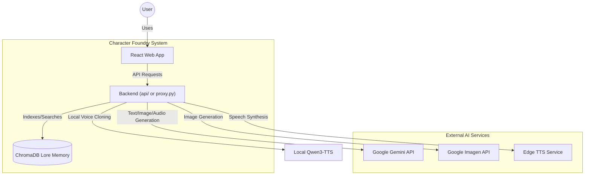
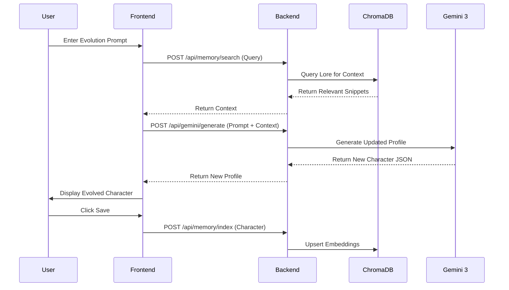

# System Architecture: Character Foundry

This document describes the high-level architecture of the Character Foundry using the C4 model and sequence diagrams.

## Container Diagram

The system consists of a React frontend and two possible backend runtimes (Local Proxy and Serverless Functions) that orchestrate calls to external AI services and local vector storage.

## Data Flow: Character Evolution with Memory

This diagram traces how a character evolves while maintaining consistency via RAG.

## Core Components

### 1. Frontend (React 19)
- **State**: Managed via `zustand` (Character store) with persistence.
- **Async Operations**: Orchestrated by `TanStack Query` hooks in `hooks/useAI.ts`.
- **Validation**: Schema-first validation using `zod`.

### 2. Backend (Serverless api/)
- **Runtime**: Python 3.12 managed by `uv`.
- **Handlers**: Single-purpose serverless handlers in `api/gemini/`, `api/tts/`, etc.
- **Local Dev**: `proxy.py` mirrors the serverless environment for standard Flask development.

### 3. AI Orchestration
- **Lore Memory**: ChromaDB provides a local vector store in `./.memory/`.
- **Text-to-Speech**: Multi-provider support (Google, Edge, and local Qwen3-TTS voice cloning).
- **Image Generation**: High-fidelity character portraits via Gemini 3.1 Flash Image.

## Key Design Principles
1. **Source of Truth**: The `api/` directory is the canonical production path.
2. **Deterministic Evolution**: Past character traits are indexed as vector embeddings to prevent AI "hallucination drift" during long sessions.
3. **Type Strictness**: No `any` types in core service logic; all API contracts are validated by Zod schemas.
